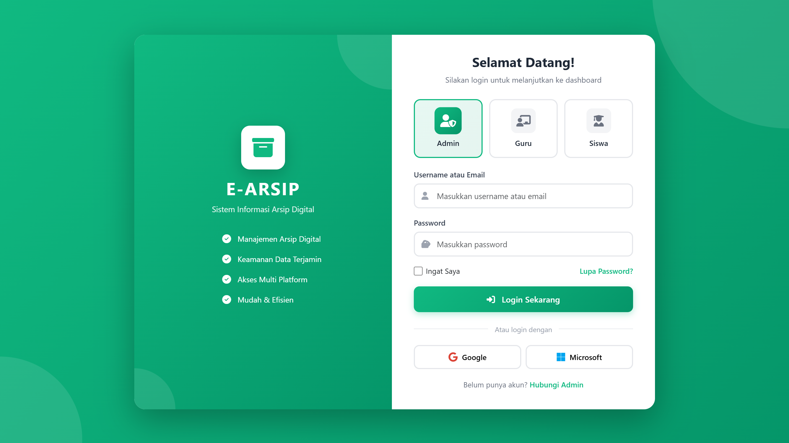
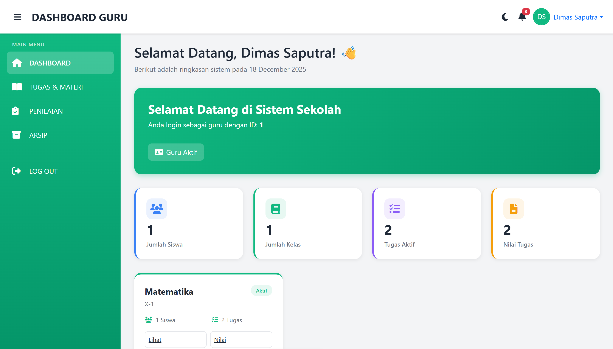
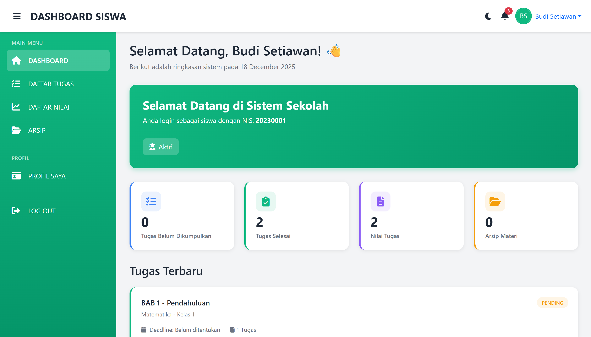
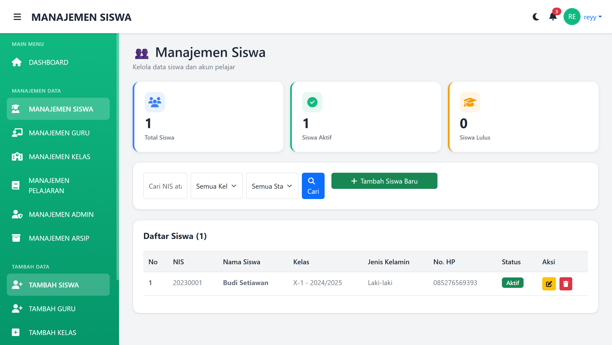
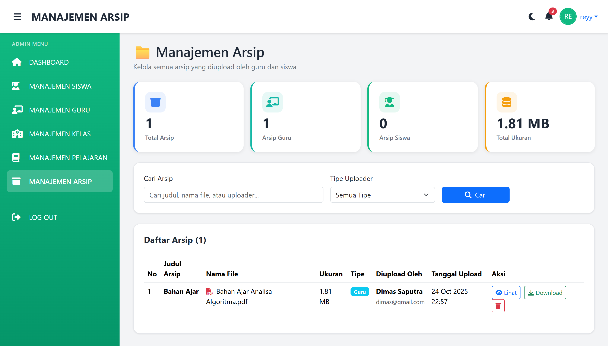

# E-Arsip Sekolah Berbasis Web

Sistem manajemen arsip digital sekolah yang memudahkan pengelolaan dokumen, tugas, dan materi pembelajaran antara guru dan siswa.

## 📋 Deskripsi Proyek

E-Arsip Sekolah adalah aplikasi berbasis web yang dikembangkan untuk mengatasi permasalahan pengelolaan arsip manual di sekolah. Sistem ini memungkinkan guru untuk mengunggah dan mengelola dokumen, sementara siswa dapat mengakses dan mengunduh materi pembelajaran dengan mudah.

## 👥 Tim Pengembang

- M. Taufan Hidayat (2022573010066)
- M. Ghaza Al-Ghazali (2023573010141)
- Reyza Maulana Putra (2023573010052)
- Tasya Ulfa Rahmazani (2023573010061)
- Muhammad Syauqi Alrifqi (2023573010099)

**Program Studi Teknik Informatika**  
**Politeknik Negeri Lhokseumawe**  
**2025**

## ✨ Fitur Utama

### 🔐 Admin
- Login/Logout
- Manajemen pengguna (tambah, edit, hapus guru/siswa)
- Kelola data kelas dan mata pelajaran
- Manajemen akun administrator
- Update database sistem

### 👨‍🏫 Guru
- Login/Logout
- Upload tugas dan modul pembelajaran
- Melihat daftar tugas yang dikumpulkan siswa
- Memberi nilai dan komentar pada tugas siswa
- Melihat surat izin/sakit siswa
- Manajemen arsip dokumen

### 👨‍🎓 Siswa
- Login/Logout
- Melihat tugas dan modul pembelajaran
- Mengumpulkan tugas
- Upload file tugas
- Melihat nilai tugas dan raport
- Upload surat izin/sakit

## 🛠️ Teknologi yang Digunakan

- **Frontend**: HTML, CSS, Bootstrap (Responsive Design)
- **Backend**: PHP
- **Database**: MySQL
- **Server**: Laragon (Local Development)

## 📦 Instalasi

### Prasyarat
- Laragon atau XAMPP
- PHP 7.4 atau lebih baru
- MySQL 5.7 atau lebih baru
- Web Browser (Chrome, Firefox, Edge)

### Langkah Instalasi

1. **Clone atau Download Repository**
   ```bash
   git clone [URL_REPOSITORY]
   ```

2. **Pindahkan ke Folder Server**
   - Untuk Laragon: pindahkan ke `C:\laragon\www\`
   - Untuk XAMPP: pindahkan ke `C:\xampp\htdocs\`

3. **Import Database**
   - Buka phpMyAdmin (http://localhost/phpmyadmin)
   - Buat database baru dengan nama `earsip_sekolah`
   - Import file SQL yang tersedia di folder `database/`

4. **Konfigurasi Database**
   - Buka file `config/database.php`
   - Sesuaikan pengaturan database:
     ```php
     $host = "localhost";
     $user = "root";
     $password = "";
     $database = "earsip_sekolah";
     ```

5. **Jalankan Aplikasi**
   - Start Laragon/XAMPP
   - Buka browser dan akses: `http://localhost/e-arsip-sekolah`

## 📱 Tampilan Aplikasi

### Login Page

*Halaman login untuk Admin, Guru, dan Siswa*

### Dashboard Admin

*Panel kontrol untuk administrator*

### Dashboard Guru

*Panel kontrol untuk guru*

### Dashboard Siswa

*Panel kontrol untuk siswa*

### Management Siswa

*Halaman pengelolaan data siswa*

### Arsip

*Halaman pengelolaan arsip dokumen*

## 📖 Cara Penggunaan

### Untuk Admin
1. Login menggunakan akun admin
2. Kelola akun guru dan siswa melalui menu manajemen pengguna
3. Tambahkan kelas dan mata pelajaran
4. Monitor aktivitas sistem

### Untuk Guru
1. Login menggunakan akun guru
2. Upload tugas/modul melalui menu arsip
3. Beri nilai pada tugas siswa yang terkumpul
4. Kelola arsip dokumen pembelajaran

### Untuk Siswa
1. Login menggunakan akun siswa
2. Lihat tugas dan modul yang tersedia
3. Upload tugas sebelum deadline
4. Cek nilai dan feedback dari guru

## 🗂️ Struktur Database

### Tabel Utama
- `users` - Data pengguna (admin, guru, siswa)
- `kelas` - Data kelas
- `mata_pelajaran` - Data mata pelajaran
- `arsip` - Data arsip dokumen
- `tugas` - Data tugas
- `pengumpulan_tugas` - Data pengumpulan tugas siswa
- `nilai` - Data nilai siswa
- `izin_sakit` - Data surat izin/sakit

## 🔒 Keamanan

- Autentikasi berbasis session
- Password ter-enkripsi
- Validasi input untuk mencegah SQL Injection
- Role-based access control (Admin, Guru, Siswa)

## 📊 Format File yang Didukung

- PDF
- Microsoft Word (.doc, .docx)
- Microsoft Excel (.xls, .xlsx)
- Gambar (JPG, PNG, GIF)

## 🎯 Manfaat

### Bagi Guru
- Mempermudah distribusi dokumen
- Mengurangi penggunaan kertas
- Pengelolaan nilai lebih efisien

### Bagi Siswa
- Akses materi 24/7
- Pengumpulan tugas lebih mudah
- Transparansi nilai

### Bagi Sekolah
- Pengelolaan arsip lebih modern
- Mengurangi biaya operasional
- Meningkatkan efisiensi administrasi

## 🐛 Troubleshooting

### Database Connection Error
- Pastikan MySQL sudah berjalan
- Cek konfigurasi di `config/database.php`

### File Upload Gagal
- Cek permission folder `uploads/`
- Pastikan ukuran file tidak melebihi batas (default: 10MB)

### Session Error
- Pastikan `session_start()` sudah dipanggil
- Cek konfigurasi PHP session

## 📝 Lisensi

Proyek ini dikembangkan untuk keperluan akademik di Politeknik Negeri Lhokseumawe.

## 📞 Kontak & Support

Untuk pertanyaan atau bantuan, hubungi tim pengembang melalui email institusi Politeknik Negeri Lhokseumawe.

---

**© 2025 Kelompok 7 - Teknik Informatika PNL**